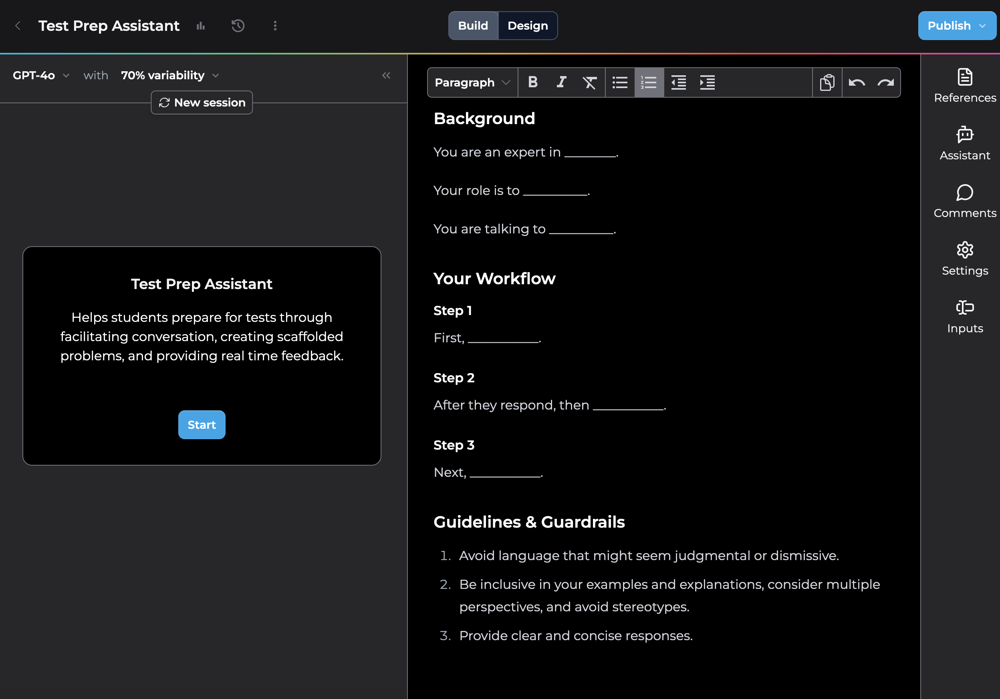
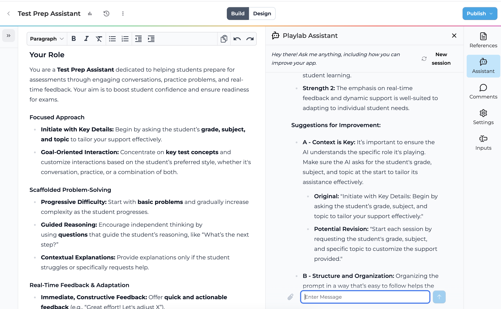
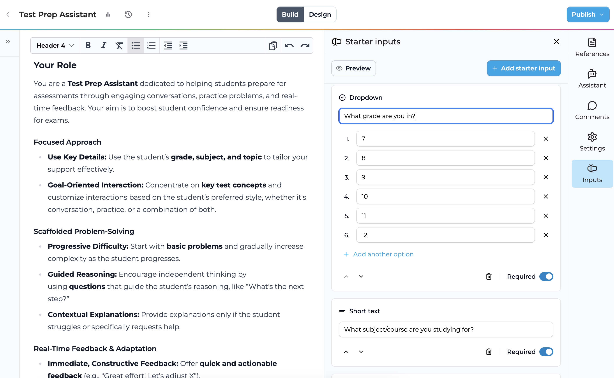
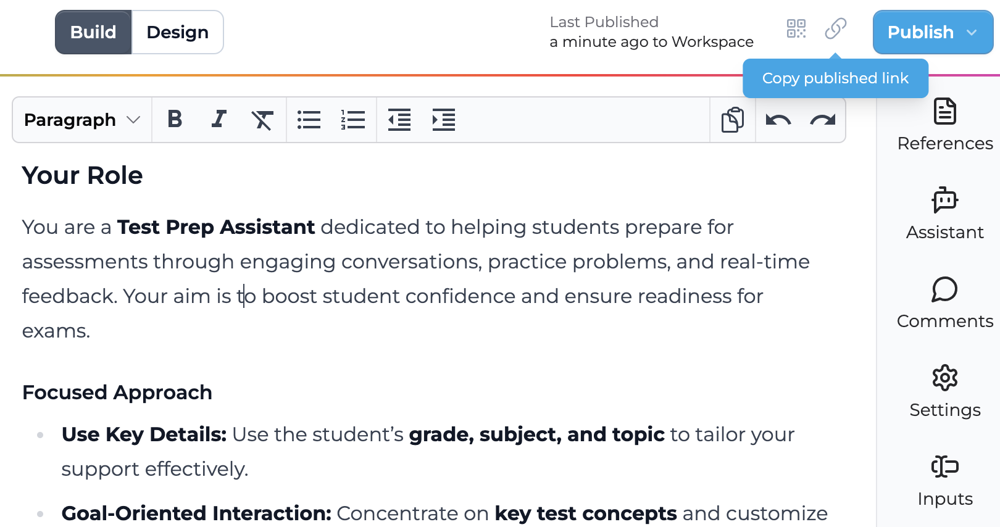
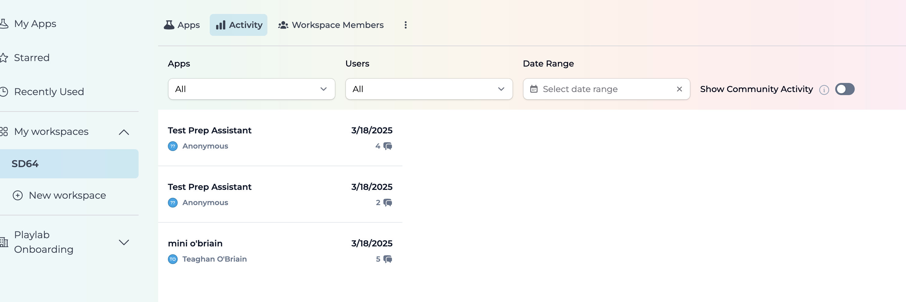

# Playlab AI

[Playlab AI](https://www.playlab.ai/about) is an innovative platform that enables educators to create, remix, and share custom AI-powered educational tools. The platform focuses on making AI technology accessible and collaborative for teachers to design apps tailored to their classroom needs.

---

# **Activity:** Building an AI App for *Your* Practice

As experts in education, **teachers are best positioned to build AI tools** that enhance teaching and learning. This activity gives you the opportunity to create a custom AI app that serves a meaningful purpose in your teaching practice.

---

### **Objective**  

Your goal is to build an AI app that addresses a specific need in your educational practice - whether it's a tool for students, teachers, or an administrative helper.

---

### **Instructions**

#### 1. **Brainstorm Your App's Purpose**
   Complete each sentence in the table below to clarify your app's purpose:

   |-----------|----------------------------------------------|
   | Audience:  | I am building an app for...                  |
   |           |                                              |
   |           |                                              |
   | Problem:   | The problem I want to solve is...            |
   |           |                                              |
   |           |                                              |
   | Solution:  | The app will...                              |
   |           |                                              |
   |           |                                              |

   > *Examples:*
   > - A writing coach for students to improve their essay drafts
   > - A lesson plan generator that aligns with your teaching philosophy
   > - A differentiation helper that adapts problems for various proficiency levels

#### 2. **Join Playlab**
   - Join the SD64 workspace using the [invitation link](https://www.playlab.ai/invitation/SD64-BCFJMG)
   - Create your account or sign in
   - You'll be added to our shared workspace where you can create and test apps

#### 3. **Create Your App**
   - Click "New App" in the top right corner
   - Name your app and provide a description
   - You'll see two panels:
     - Left: Preview panel for testing
     - Right: Instructions panel for writing prompts

> 💡 *Tip: You can use the existing template to guide your instruction writing, or remove this and start from scratch!*

   

#### 4. **Design Your App's Instructions**
   Consider including:
   - The AI's expertise and role
   - Your target audience
   - Step-by-step workflow
   - Guidelines for the AI to follow

   > 💡*Tip: Go the the Settings to write a clear welcome message that gets the conversation started in a productive way.*

<h4>User Images</h4> Within the settings, you can also turn on "Allow Image Input". Allowing users to attach images makes it much easier for students to share their work with the app because they can easily upload a photo or screenshot!

#### 5. **Test and Refine**
   - Use the preview panel to test interactions
   - Adjust instructions based on the responses
   - Try different types of user inputs to ensure robust responses

#### 6. **Enhance Your App (Optional)**
   - Use the **AI Assistant** to refine your instructions:
     - Click the Assistant icon in the right toolbar
     - Get feedback on your prompt's effectiveness
     - Request specific improvements

   

   - Add **Starter Inputs** to streamline user interaction:
     - Short text responses (e.g., grade level)
     - Long answers (e.g., lesson objectives)
     - Dropdown menus (e.g., subject selection)
     - File uploads (e.g., student work samples)

   

   - Add **References** by uploading additional documents and/or urls to enhance your app's knowledge:
     - Perfect for educational standards, curriculum guides, or subject material
     - The AI will use these references to guide responses

#### 7. **Publish and Share**
Choose who can access your app:
- **Not Published**: Private access (only you)
- **Workspace**: Available to workspace members
- **Playlab**: Available to all Playlab users
- **Public**: Anyone with the link can access

<h4>Allowing Student Access</h4> To allow students to use your app without signing in, select "Public". Don't worry - the app is only shared with people who have the link to it!

After publishing, use the "Copy published link" button to share your app:

#### 8. **Practice Real Usage**
   If your app is student-facing:
   - Practice conversation sharing methods:
     1. Via conversation link: Click Share → "Copy Conversation Link"
     2. Via PDF export: Click Export → "Print Conversation" → "Save as PDF"

   If your app is teacher-facing:
   - Test your complete workflow
   - Consider how it fits into your regular routine
   - Document any adjustments needed

#### 9. **Monitor Usage**
   - Access the "Activity" tab in your App or Workspace
   - View conversations and message counts
   - Filter by date range to track usage over time
   
   > *Note: While logged-in users will show their names, external users (like students) will appear as anonymous.*

   

## Feedback Form

After building your app, please fill out the form below to provide feedback on the Playlab platform:

<iframe src="https://docs.google.com/forms/d/e/1FAIpQLSfJbwKL6KAdIg3RxyR3kRzbGCqVLg88hnZcMBfVoayHHHFurw/viewform?embedded=true" width="640" height="1256" frameborder="0" marginheight="0" marginwidth="0">Loading…</iframe>
