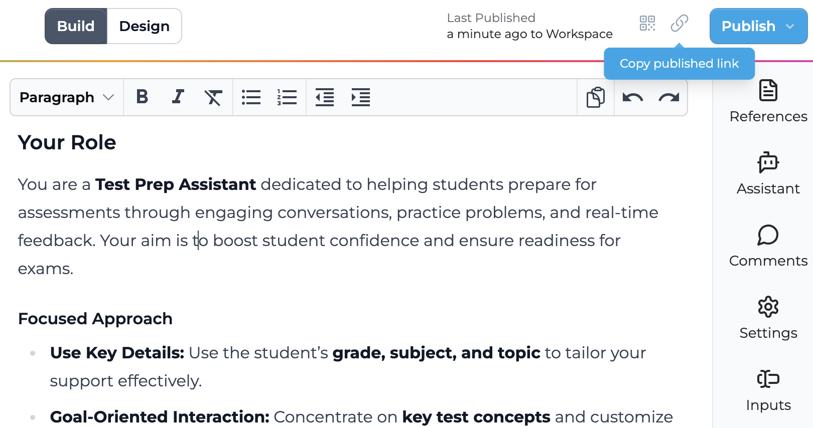

# Playlab AI

**Playlab AI** is an innovative platform that enables educators to create, remix, and share custom AI-powered educational tools. The platform focuses on making AI technology accessible and collaborative for teachers to design apps tailored to their classroom needs.

* * *

## Mission

As a 501(c)(3) nonprofit, Playlab is dedicated to democratizing AI app creation in education and advancing educational equity. The organization removes barriers to ensure AI technology is accessible to all educators, regardless of background or resources.

> For more details, visit the [Playlab Mission Page](https://www.playlab.ai/about).

* * *

## Key Features for Teachers

### Create and Collaborate
- **App Creator**: Build AI apps from scratch or remix existing ones from the Playlab community.
- **Remix Community Apps**: Browse and adapt apps created by educators worldwide.
- **Sharing**: Share created apps with colleagues, students, or the Playlab community.

### Tools for Teachers
- **Lesson Planning**: AI assistants to help generate lesson plans, activities, and assessments.
- **Administrative Support**: Tools for grading, feedback generation, and progress tracking.
- **Resource Creation**: Automated creation of worksheets, study guides, and educational materials.
- **Differentiation Helper**: Tools to adapt content for various learning levels and styles.

### Tools for Students
- **Project Assistant**: AI-powered guidance for research and project development.
- **Writing Coach**: Help with composition, editing, and writing improvement.
- **Interactive Learning**: Real-world context generators and scenario-based learning tools.
- **Study Support**: Personalized study guides and practice problem generators.
- **Skill Development**: Tools for critical thinking, problem-solving, and creative exploration.

* * *

## Privacy Policies

Playlab AI maintains strict privacy and data protection standards designed specifically for educational environments:

### Key Compliance & Commitments
- Fully compliant with FERPA (Family Educational Rights and Privacy Act), COPPA (Children's Online Privacy Protection Act), and ERMA (Educational Rights Management Act)
- Vetted and approved for use in Chicago Public Schools (CPS) and other school districts
- No advertising, tracking, or marketing to students
- All data is encrypted in transit and at rest
- Student data is used exclusively for educational purposes authorized by educators/schools
- Personal information is retained for no longer than 12 months unless otherwise agreed

### Student Data Protection
- No selling or sharing of student data
- No third-party advertising or marketing
- Schools and parents maintain direct control over student data
- Students under 13 require parent/guardian consent
- Comprehensive security measures to protect student information

For complete details about their data protection practices and privacy commitments, please visit the [Privacy Policy page](https://www.playlab.ai/policies/privacy).

* * *

## Getting Started

For great videos on how to get started using Playlab, check out [this page](https://playlabai.notion.site/Getting-Started-on-Playlab-7b9b79c5ea964c3b88b9229c7d012677)!

I've summarize some of the key takeaways here.

### Creating an App
1. In your workspace, click "New App" in the top right corner
2. Give your app a name and description
3. After clicking "Create App", you'll see two main panels:
   - Left: Preview panel for testing your app
   - Right: Instructions panel for writing prompts
4. You can use the existing template to guide your instruction writing, or remove this and start from scratch!

When writing your instructions, consider including:
- The AI's expertise and role
- Your target audience (e.g., educators, students)
- A step-by-step workflow of what the app should do
- Guidelines and guardrails for the AI to follow

* * *

### Using the AI Assistant
The AI Assistant is your prompt-building partner, helping you create more effective apps:
- Access it from the right toolbar's
- The assistant will:
  - Analyze your current prompt
  - Highlight existing strengths
  - Suggest specific improvements
  - Provide revised versions upon request

* * *

### Customizing Your App
#### Basic Settings
- Edit the app name, welcome message, and description at any time
- Allow image inputs from the users

<h4>User Images:</h4> Allowing users to attach images makes it much easier for students to share their work with the app because they can easily upload a photo or screenshot!

#### Starter Inputs
Streamline initial interactions by collecting information through four input types:

- **Short Text**: Single-line responses (e.g., grade level, subject)
- **Long Answer**: Detailed responses for preferences or explanations
- **Dropdown Menus**: Predefined choices
- **File Upload**: Document submission for additional context

#### Adding References
Upload additional documents and/or urls to enhance your app's knowledge:
- Perfect for educational standards, curriculum guides, or subject material
- The AI will use these references to guide responses
> References are shared across your workspace and you can search through your reference library

#### Choosing AI Models
Select from a range of AI models based on your needs:

| Model | Best For | Key Strengths | Trade-offs |
|:------|:---------|:-------------|:-----------|
| Claude 3 Opus | Complex analysis, math, coding | Highly accurate, follows detailed instructions | Slower response times |
| Claude 3.5 Sonnet | General tasks, creative work | Good speed/accuracy balance, versatile | Less powerful than 3.7 models |
| Claude 3.7 Sonnet | Balanced performance | Fast, accurate, good instruction following | Not specialized for reasoning |
| Claude 3.7 Sonnet (Reasoning) | Step-by-step problem solving | Excellent at math, coding, explanations | Slower, less creative |
| Gemini 2 Flash | Quick, simple tasks | Very fast responses | May miss complex instructions |
| GPT-4o | Multi-step tasks | Well-balanced, versatile | Medium speed, can overcomplicate |
| Llama 3.3 | General tasks, math | Strong overall performance | Slower, less precise |
| O1 Reasoning | Complex problem-solving | Excellent reasoning, high accuracy | Slow, not for creative tasks |

Adjust the **variability** (0-100%) to control response consistency:
- Lower: More consistent outputs
- Higher: More varied, creative responses
- 70%: Recommended default

> [This document](https://docs.google.com/document/d/154eoY8_7-gIHiyHWVd_OwHmgExRF4POlmZBJRHqjyeU/edit?tab=t.0) provides some great advice on choosing the right model. 

* * *

### Sharing Your App
Choose who can access your app:
- **Not Published**: Private access (only you)
- **Workspace**: Available to workspace members
- **Playlab**: Available to all Playlab users
- **Public**: Anyone with the link can access

<h4>Important for Teachers:</h4> To allow students to use your app without signing in, select "Public". Don't worry - the app is only shared with people who have the link to it!

After publishing, use the "Copy published link" button to share your app:

* * *

### Monitoring Usage
Track app usage through the "Activity" tab in your App or Workspace:
- View conversations and message counts
- Filter by app, user, or date range

> **Note**: While you can see the names of users who have logged in, external users appear as anonymous.

* * *

### Collecting Student Conversations
Since students will be seen as "anonymous" users, you can have them share their conversations with you in two ways:

1. **Share Link**
   - Click the Share button
   - Select "Copy Conversation Link"
   - Share the link with the teacher

2. **PDF Export**
   - Click Export
   - Select "Print Conversation"
   - Select "Save as PDF" as the printer
   - Submit the PDF file to the teacher

* * *

### Remixing Existing Apps

Save time by building on existing apps! You can remix:
- Your own apps (to test variations)
- Community apps (to adapt their ideas)

#### How to Remix
1. Browse the [Playlab Community](https://www.playlab.ai/explore)
2. Find an app you like
3. Click "Remix this app"
4. Make it your own:
   - Start with small changes
   - Test as you go
   - Keep what works

* * *

## Resources

- [Playlab AI Website](https://www.playlab.ai)
- [Playlab Community](https://www.playlab.ai/explore)
- [Playlab's Privacy Policies](https://www.playlab.ai/policies/privacy)