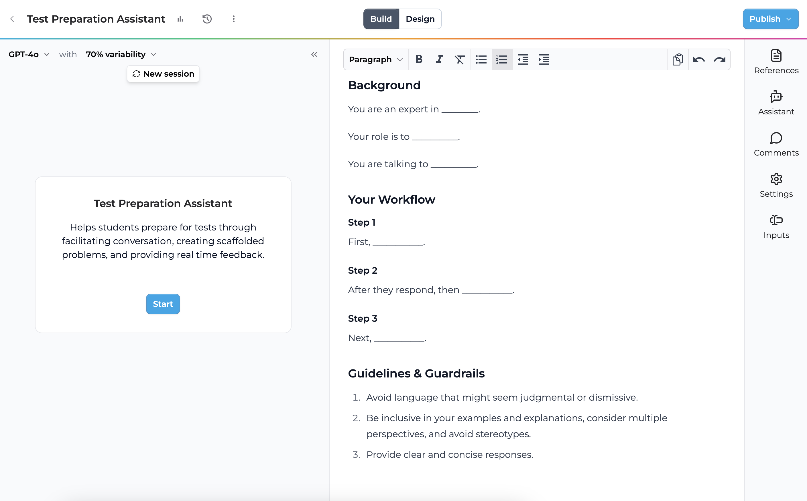

# Playlab AI

**Playlab AI** is an innovative platform designed to enable educators to create, remix, and share custom AI-powered educational tools. With a focus on accessibility and collaboration, Playlab AI allows teachers to design apps tailored to their classroom needs, fostering creativity and personalized learning experiences.

* * *

## Mission and Vision

Playlab's mission is to democratize AI app creation in education, empowering teachers to build tools that enhance student learning. As a 501(c)(3) nonprofit, Playlab is dedicated to advancing educational equity and ensuring that AI technology is accessible to all, regardless of background or resources. Playlab focuses on removing barriers so that educators can create AI apps to engage students and meet their specific needs.

> For more details, visit the [Playlab Mission Page](https://www.playlab.ai/about).

* * *

## Key Features for Teachers

Playlab AI offers a flexible environment where educators can create or remix apps, customize them to their curriculum, and share them with other educators. The platform supports collaboration, allowing teachers to adapt community-built tools or start from scratch to design personalized educational experiences.

### Create and Collaborate
- **App Creator**: Build AI apps from scratch or remix existing ones from the Playlab community.
- **Remix Community Apps**: Browse and adapt apps created by educators worldwide, customizing them to fit specific classroom needs.
- **Sharing**: Share created apps with colleagues, students, or the Playlab community, promoting collaboration across schools and districts.

### Tools for Students

Playlab AI also supports students by providing tools designed to help them engage in creative and interactive learning. These include project assistants, writing coaches, and real-world context generators, all of which foster critical thinking and student agency in learning.

* * *

## Privacy Policies

Playlab AI maintains strict privacy and data protection standards designed specifically for educational environments:

### Key Compliance & Commitments
- Fully compliant with FERPA (Family Educational Rights and Privacy Act), COPPA (Children's Online Privacy Protection Act), and ERMA (Educational Rights Management Act)
- Vetted and approved for use in Chicago Public Schools (CPS) and other school districts
- No advertising, tracking, or marketing to students
- All data is encrypted in transit and at rest
- Student data is used exclusively for educational purposes authorized by educators/schools
- Personal information is retained for no longer than 12 months unless otherwise agreed

### Student Data Protection
- No selling or sharing of student data
- No third-party advertising or marketing
- Schools and parents maintain direct control over student data
- Students under 13 require parent/guardian consent
- Comprehensive security measures to protect student information

For complete details about their data protection practices and privacy commitments, please visit the [Privacy Policy page](https://www.playlab.ai/policies/privacy).

* * *

## Getting Started

For great videos on how to get started using Playlab, check out [this page](https://playlabai.notion.site/Getting-Started-on-Playlab-7b9b79c5ea964c3b88b9229c7d012677)!

I've summarize some of the key takeaways here.

### Creating an App
1. In your workspace, click "New App" in the top right corner
2. Give your app a name and description
3. After clicking "Create App", you'll see two main panels:
   - Left: Preview panel for testing your app
   - Right: Instructions panel for writing prompts
4. You can use the existing template to guide your instruction writing, or remove this and start from scratch!

When writing your instructions, consider including:
- The AI's expertise and role
- Your target audience (e.g., educators, students)
- A step-by-step workflow of what the app should do
- Clear conversation rules and output structure
> Plan for 3-5 iterations of testing and refinement

### Using the AI Assistant
The AI Assistant is your prompt-building partner, helping you create more effective apps:
- Access it from the right toolbar's
- The assistant will:
  - Analyze your current prompt
  - Highlight existing strengths
  - Suggest specific improvements
  - Provide revised versions upon request

### Customizing Your App
#### Basic Settings
- Edit the app name, welcome message, and description at any time
- Allow image inputs from the users
> Image inputs make it much easier for student users to share their work with the app because they can easily upload a photo or screenshot!

#### Starter Inputs
Streamline initial interactions by collecting information through four input types:

- **Short Text**: Single-line responses (e.g., grade level, subject)
- **Long Answer**: Detailed responses for preferences or explanations
- **Dropdown Menus**: Predefined choices (minimum two options)
- **File Upload**: Document submission for additional context

Each input can be:
- Marked as required/optional
- Reordered through drag-and-drop
- Previewed before publishing

[Screenshot: Starter Inputs panel showing different input types]

#### Adding References
Upload additional documents to enhance your app's knowledge:
- Support formats like PDFs and text files
- Perfect for educational standards, curriculum guides, or subject material
- AI will incorporate these references in responses
- Manage references through the References tab:
  - Add/remove documents as needed
  - Search through your reference library
  - Toggle reference usage per app

[Screenshot: References upload interface]

#### Choosing AI Models
Select the right model for your needs:
- GPT-4 Turbo and Claude v2.1:
  - Best for complex reasoning
  - Ideal for starting out
- GPT-3.5 Turbo and Claude Instant:
  - Faster response times
  - Good for straightforward tasks
- Adjust variability (0-100%):
  - 0%: Consistent, predictable responses
  - 100%: More varied, creative outputs
  - 70%: Default, works for most cases

[Screenshot: Model selection interface]

### Sharing Your App
Control access to your app through multiple levels:
- Not Shared: Private access only
- Workspace: Available to workspace members
- Organization: Accessible across your organization
- Playlab: Available to all Playlab users
- Public: Anonymous access via link

Note: Public links won't provide usage data, while other sharing levels allow tracking of user interactions.

[Screenshot: Share settings panel]

### Monitoring Usage
Track how your app is being used:
- Access the Review tab in your workspace
- View individual conversations and message counts
- Filter by specific apps or users
- See usage patterns and engagement
> Note: You can only view named usage data for members of your workspace; external users appear as anonymous

[Screenshot: Usage analytics dashboard]

### Remixing Existing Apps
Learn from and build upon the community's work:
1. Explore existing tools in your area of interest
2. Test at least three different tools for inspiration
3. Click "Remix this app" on promising tools
4. When remixing:
   - Understand the original tool's purpose
   - Plan your modifications
   - Read through the entire prompt first
   - Make small, incremental changes
   - Test frequently as you modify
   - Document your changes
   - Consider both similar and different use cases for broader inspiration

[Screenshot: Remix interface with example modifications]

Tips for Success:
- Start with focused, specific goals
- Test your app frequently during development
- Use the AI Assistant for guidance and improvements
- Learn from the community's existing tools
- Document changes when remixing
- Consider collaborating with others in your workspace

For more detailed guides and resources, visit the [Playlab Community](https://www.playlab.ai/explore).

* * *

## Resources

- [Playlab AI Website](https://www.playlab.ai)
- [Playlab Community](https://www.playlab.ai/explore)